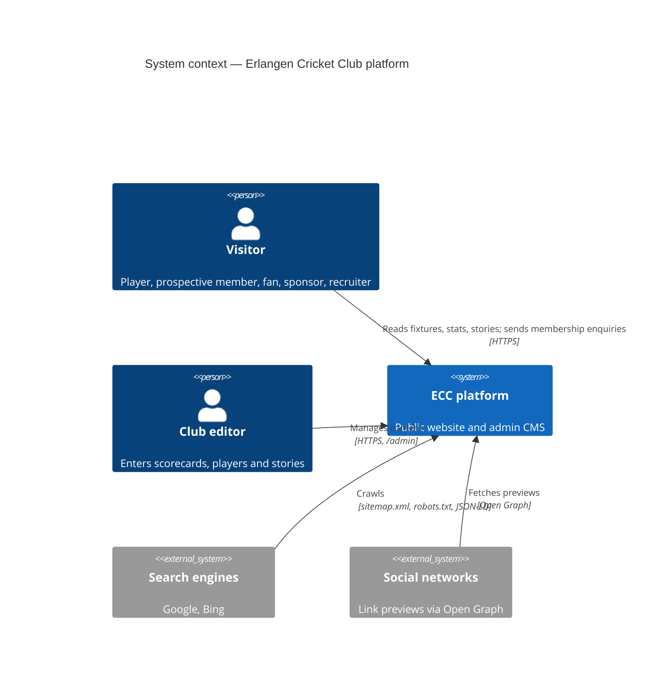
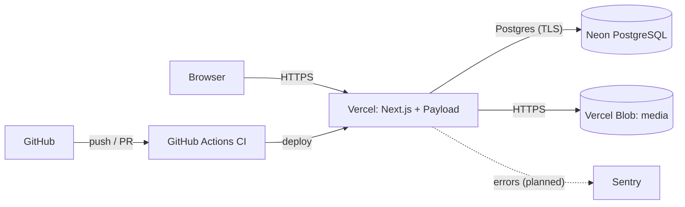

# 3. Context & Scope

## 3.1 Business context (C4 level 1)

| Partner         | Input to the platform               | Output from the platform                           |
| --------------- | ----------------------------------- | -------------------------------------------------- |
| Visitor         | Membership enquiries (planned)      | Localised pages (en/de)                            |
| Club editor     | Scorecards, players, stories, media | Admin UI                                           |
| Search engines  | —                                   | Sitemap, robots.txt, hreflang, structured data     |
| Social networks | —                                   | Open Graph / Twitter metadata, OG images (planned) |

## 3.2 Technical context

Out of scope: online payments, live ball-by-ball scoring, a native mobile app.
