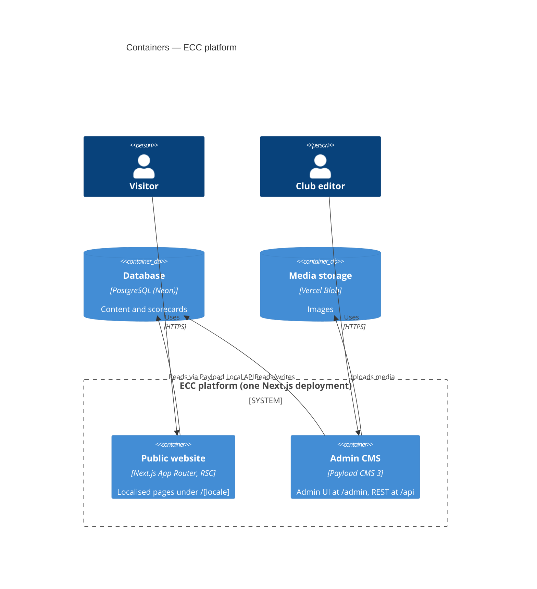
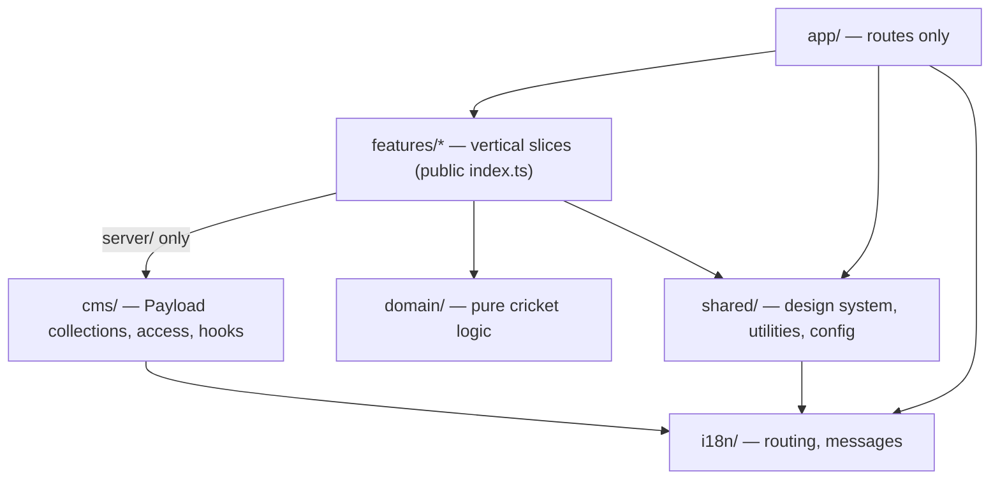
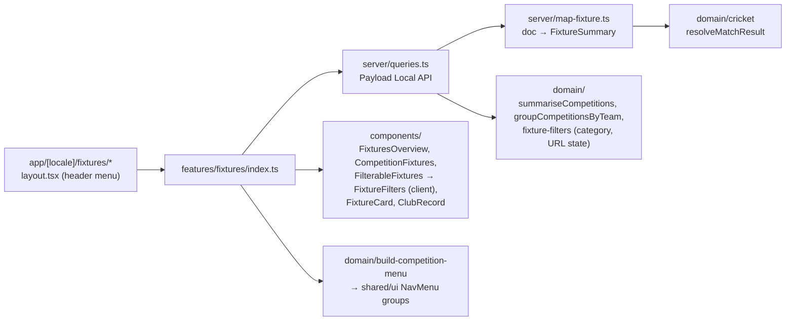
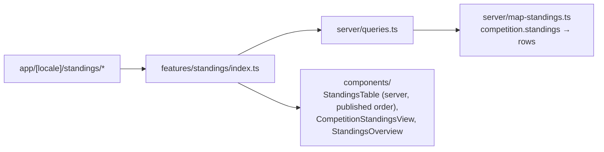

# 5. Building Block View

## 5.1 Containers (C4 level 2)

## 5.2 Modules (C4 level 3) — `src/`

| Module               | Responsibility                                                       | May depend on                              |
| -------------------- | -------------------------------------------------------------------- | ------------------------------------------ |
| `app/`               | Route composition, metadata; no business logic                       | features (via `index.ts`), shared, i18n    |
| `features/<x>/`      | One business capability (players, fixtures, …)                       | domain, shared, other features' `index.ts` |
| `features/*/server/` | Data access through the Payload Local API                            | + Payload                                  |
| `domain/`            | Pure TypeScript: averages, strike rate, economy, NRR, milestones     | nothing outside `domain/`                  |
| `shared/`            | `ui/` design system, `lib/` utilities, `config/` env and site config | i18n                                       |
| `cms/`               | Payload collections, globals, access control, hooks                  | Payload, i18n                              |
| `i18n/`              | Locales, routing, message catalogues                                 | next-intl                                  |

These rules are encoded in [`.dependency-cruiser.cjs`](../../.dependency-cruiser.cjs) and checked in CI.

### Current contents

| Path                   | Contents                                                                                                                                                                                                                                    |
| ---------------------- | ------------------------------------------------------------------------------------------------------------------------------------------------------------------------------------------------------------------------------------------- |
| `domain/cricket/`      | Batting average, strike rate, overs notation, `resolveMatchResult`, `getTeamOutcome`                                                                                                                                                        |
| `shared/ui/`           | `Button`, `Badge`, `Skeleton`, `Container`, `SkipLink`, `JsonLd`, `SiteHeader`, `SiteFooter`, `NavLink`, `NavMenu`, `LocaleSwitcher`, `Breadcrumbs`, `TeamMonogram`, `PillGroup` (single-choice filter pills, used by fixtures and players) |
| `shared/lib/`          | `cn`, `slugify`, `getMonogram`, SEO helpers (`buildAlternates`, `BreadcrumbList` / `SportsOrganization` JSON-LD)                                                                                                                            |
| `shared/config/`       | `parseServerEnv` (Zod), `siteConfig`, `MAIN_NAVIGATION`                                                                                                                                                                                     |
| `cms/collections/`     | `fixtures`, `teams`, `competitions` (with `slug`, `standings`), `news` (drafts), `media`, `documents` (PDFs), `contact-messages`, `sponsors`, `players` (consent-gated), `users`                                                            |
| `cms/globals/`         | `membership` (fees, training and match days, application form, hero photo), `contact` (email, social media, ground with coordinates), `journey` (story chapters, milestones), `impressum`, `privacy-policy`                                 |
| `cms/hooks/`           | Fixture title, on-demand revalidation of all localised pages                                                                                                                                                                                |
| `cms/seed/`            | Idempotent import of 2026 results: ECC-I (DCB-Bundesliga Südost, BCV T20 Regionalliga), ECC-II (BCV Regionalliga, BCV T20 1. Verbandsliga)                                                                                                  |
| `features/standings/`  | League tables — see below                                                                                                                                                                                                                   |
| `features/news/`       | News articles — see below                                                                                                                                                                                                                   |
| `features/membership/` | Membership page — see below                                                                                                                                                                                                                 |
| `features/contact/`    | Contact page and contact form — see below                                                                                                                                                                                                   |
| `features/journey/`    | Journey page — see below                                                                                                                                                                                                                    |
| `features/players/`    | Squad and player profiles — see below                                                                                                                                                                                                       |
| `features/sponsors/`   | Sponsors page — see below                                                                                                                                                                                                                   |
| `features/fixtures/`   | Fixtures & Results — see below                                                                                                                                                                                                              |
| `features/legal/`      | Impressum and Datenschutz pages: content from Payload globals (`impressum`, `privacy-policy`), rich text, localised                                                                                                                         |

### `features/home`

| Route | Content                                                                                                                                                                                                                                                   |
| ----- | --------------------------------------------------------------------------------------------------------------------------------------------------------------------------------------------------------------------------------------------------------- |
| `/`   | Hero (crest, club name, join and fixtures, training time) with the next match on the ground scoreboard; the season record as an LED scoreboard band; the squad as a pinned line-up; where we stand; latest results; news; Instagram posts; join; sponsors |

`server/queries.ts` gathers everything through the other features' public APIs (`getMatchday`, `getStandingsOverview`, `getPlayers`, `getNewsList`, `getSponsors`, `getContactInfo`, `getMembershipInfo`); the page only renders. The next match widget counts down (ticking every second, client component rendered after hydration because the page is static) to the next fixture of a **featured** competition: editors tick "Show next match on the home page" on a competition (T20 Regionalliga and DCB-Bundesliga). It shows date, kick-off, ground, home or away (from the venue: a ground in Erlangen is a home game), "Add to calendar" (`/calendar/fixture-{id}.ics`) and directions (a Google Maps link, no embed). The squad line-up shows the players editors tick "Show in the home page line-up" (up to seven; until anyone is ticked, players with a photo). Between seasons the same card shows "TBD" and "{next season} fixtures coming soon", so the layout does not change when fixtures arrive. The latest Instagram posts come from `features/instagram` ([ADR-0011](../09-architecture-decisions/0011-instagram-feed-via-api.md)). On phones, results, tables and news are swipeable rails (`CardRail`); from md they are grids. The page revalidates hourly, so a played fixture leaves "Next match" without a CMS change.

### `features/instagram`

Instagram post graphics (1080×1350 PNG) for upcoming matches, results and players, generated on request with `next/og` at `/instagram/{locale}/{kind}-{id}.png` and downloaded by editors from the fixture and player edit views ([ADR-0010](../09-architecture-decisions/0010-instagram-graphics-generated-on-request.md)). The file-name helpers live in `shared/lib/instagram-graphic.ts`, so the admin component can use them without loading server code.

### `features/fixtures`

Routes ([ADR-0005](09-architecture-decisions/0005-fixtures-pages-per-competition.md)):

| Route                       | Content                                                                                                                                       |
| --------------------------- | --------------------------------------------------------------------------------------------------------------------------------------------- |
| `/fixtures`                 | All fixtures together; filters: competition (grouped by team), status (upcoming, completed, abandoned, walkover, forfeit), result (won, lost) |
| `/fixtures/[competition]`   | One competition: record, fixtures filterable by status and result, breadcrumbs                                                                |
| Header menu (locale layout) | Latest season's competitions grouped by club team                                                                                             |

The mapper is the anti-corruption layer between Payload's document shape and the UI's view model; components never see Payload types.

`buildCompetitionMenu` is shared with standings: the header's Fixtures and Standings dropdowns list the same competitions, each linking to its own section.

### `features/standings`

Routes ([ADR-0006](09-architecture-decisions/0006-standings-from-published-tables.md)):

| Route                       | Content                                                         |
| --------------------------- | --------------------------------------------------------------- |
| `/standings`                | One table per competition (latest season first)                 |
| `/standings/[competition]`  | One table, link to the competition's fixtures, breadcrumbs      |
| Header menu (locale layout) | Same competitions as the Fixtures menu (`buildCompetitionMenu`) |

Standings are the published table stored on the competition (`competitions.standings`); they do not read fixtures.

### `features/news`

| Route          | Content                                                                                          |
| -------------- | ------------------------------------------------------------------------------------------------ |
| `/news`        | Published articles, newest first: the latest as a wide lead card, the rest in a card grid        |
| `/news/[slug]` | Article: date, title, featured image (photo, or a sponsor logo shown whole), body, photo gallery |

Articles live in the Payload `news` collection (localised title, excerpt and body; drafts via versions). Public queries filter on `_status: published` because the Local API bypasses access control; the collection's read access additionally hides drafts from anonymous REST requests. `server/map-news.ts` maps documents to view models (`NewsSummary`, `NewsArticle`); pages emit `NewsArticle` and `BreadcrumbList` JSON-LD, Open Graph article metadata and sitemap entries with `lastModified`.

### `features/membership`

| Route         | Content                                                                                                             |
| ------------- | ------------------------------------------------------------------------------------------------------------------- |
| `/membership` | Photo hero with the two ways in, why join, fees as a pricing table, the week's training and match days, how to join |

Content comes from the Payload global `membership` (localised; editors change fees and sessions without a deployment) and the `documents` collection (application form PDF). `domain/week.ts` turns the sessions into the week strip. Questions and directions link to the contact page.

### `features/contact`

| Route      | Content                                                                                      |
| ---------- | -------------------------------------------------------------------------------------------- |
| `/contact` | Contact form, email and social media, the ground (two-click map, "Open in maps", directions) |

Details come from the Payload global `contact`. The map loads only on request ([ADR-0008](09-architecture-decisions/0008-maps-load-on-request.md)); `domain/map.ts` builds its URLs from the ground's coordinates. The form is a client component that calls `submitContactMessageAction`, which validates with `domain/contact-message.ts` (Zod, honeypot) and stores the message in `contact-messages` ([ADR-0007](09-architecture-decisions/0007-contact-messages-stored-in-cms.md)). The action is passed to the form as a prop, so the form is tested with a fake action.

### `features/journey`

| Route      | Content                                                                                                                 |
| ---------- | ----------------------------------------------------------------------------------------------------------------------- |
| `/journey` | Hero with key figures, the club's story in three chapters, a timeline of milestones (2010 to today), invitation to join |

Content comes from the Payload global `journey`: localised story chapters (up to three, title and text, shown as cards) and milestones (year, title, text, optional thumbnail and "Read more" link to a news article or page). `server/map-journey.ts` sorts milestones oldest first, so editors can add them in any order. Seeded from the old site's About page and news archive; claims the board corrected (player nationalities, ground dimensions) were left out.

### `features/sponsors`

| Route       | Content                                                                                                      |
| ----------- | ------------------------------------------------------------------------------------------------------------ |
| `/sponsors` | Thanks to the sponsors, one card per active sponsor (title sponsor first), why sponsor the club, contact CTA |

Sponsors are a Payload collection (name, logo, tier, since, localised description, website, optional link to the announcement in `news`, active flag). `domain/sponsors.ts` orders them (title sponsors, then longest-standing) and builds `SportsOrganization` JSON-LD with a `sponsor` list. The page is linked from the footer's "Club" menu, keeping the header short.

### `features/players`

| Route             | Content                                                                                                                                                                                                                                                                                                                                                            |
| ----------------- | ------------------------------------------------------------------------------------------------------------------------------------------------------------------------------------------------------------------------------------------------------------------------------------------------------------------------------------------------------------------ |
| `/players`        | Title with season and club numbers (players, teams, competitions from the fixtures navigation); the whole squad (built for 45+) as portrait cards (cut-out player on the club's green, first name over a bold surname, office or role chip) with a name search and team and role filters (shown once editors assign teams and roles), ending with "Join the squad" |
| `/players/[slug]` | Header with the cut-out player standing on its bottom edge beside the name (office, role and teams as tags, localised bio), playing details if recorded, career stat tiles (not recorded yet), four more players                                                                                                                                                   |

Players are a Payload collection (name, photo, playing role, batting and bowling style, club teams, board office, localised bio, slug, consent). Only players with recorded consent are public ([ADR-0009](../09-architecture-decisions/0009-player-profiles-require-recorded-consent.md)): read access and the public queries both filter on `hasPublishConsent`. `domain/players.ts` builds initials, splits names for display, searches by name (ignoring case and accents); `domain/squad-filter.ts` combines search, team and role filters and derives the filter options with counts; picks the "more players" (the next ones in squad order, wrapping around, so profiles link to each other evenly) and the `SportsTeam` / `Person` JSON-LD. Career stats are not entered by hand: they will be derived from match scorecards (`CLAUDE.md` §4.1), which are not recorded yet (TD-10). Seeded with the players from the old website's 2023–24 squad who still play for the club; their photos were cut out (background removed) once, offline, with the open-source `@imgly/background-removal-node`. Editors upload cut-out photos (transparent PNG or WebP) for the same look; a regular photo still works and sits whole at the bottom of the card.
