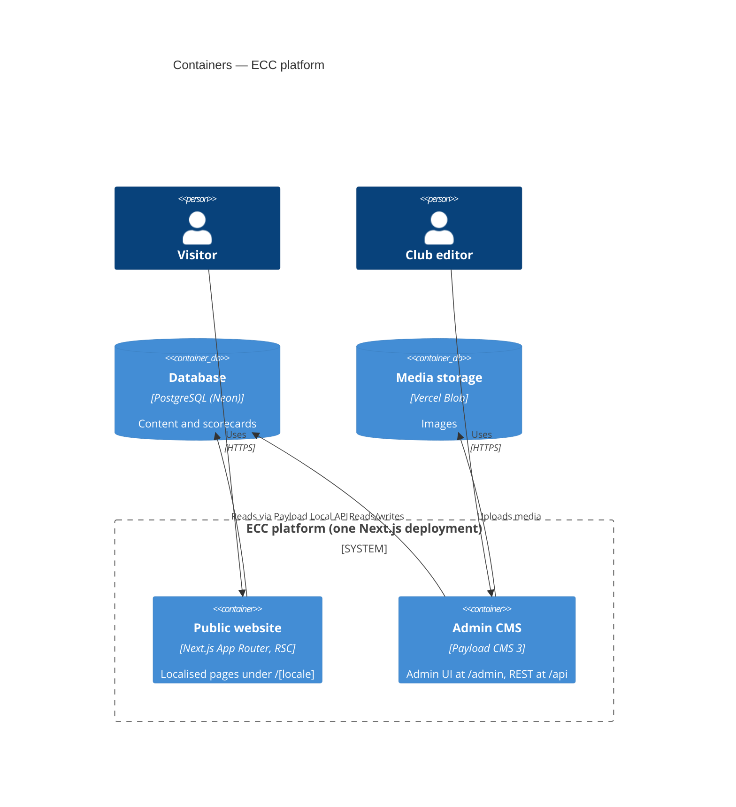
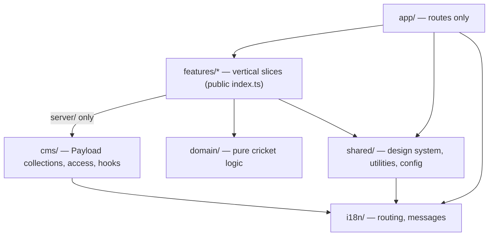
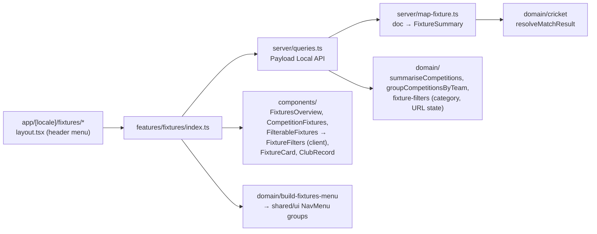

# 5. Building Block View

## 5.1 Containers (C4 level 2)

## 5.2 Modules (C4 level 3) — `src/`

| Module               | Responsibility                                                       | May depend on                              |
| -------------------- | -------------------------------------------------------------------- | ------------------------------------------ |
| `app/`               | Route composition, metadata; no business logic                       | features (via `index.ts`), shared, i18n    |
| `features/<x>/`      | One business capability (players, fixtures, …)                       | domain, shared, other features' `index.ts` |
| `features/*/server/` | Data access through the Payload Local API                            | + Payload                                  |
| `domain/`            | Pure TypeScript: averages, strike rate, economy, NRR, milestones     | nothing outside `domain/`                  |
| `shared/`            | `ui/` design system, `lib/` utilities, `config/` env and site config | i18n                                       |
| `cms/`               | Payload collections, globals, access control, hooks                  | Payload, i18n                              |
| `i18n/`              | Locales, routing, message catalogues                                 | next-intl                                  |

These rules are encoded in [`.dependency-cruiser.cjs`](../../.dependency-cruiser.cjs) and checked in CI.

### Current contents

| Path                 | Contents                                                                                                                                                            |
| -------------------- | ------------------------------------------------------------------------------------------------------------------------------------------------------------------- |
| `domain/cricket/`    | Batting average, strike rate, overs notation, `resolveMatchResult`, `getTeamOutcome`                                                                                |
| `shared/ui/`         | `Button`, `Badge`, `Skeleton`, `Container`, `SkipLink`, `JsonLd`, `SiteHeader`, `SiteFooter`, `NavLink`, `NavMenu`, `LocaleSwitcher`, `Breadcrumbs`, `TeamMonogram` |
| `shared/lib/`        | `cn`, `slugify`, `getMonogram`, SEO helpers (`buildAlternates`, `BreadcrumbList` / `SportsOrganization` JSON-LD)                                                    |
| `shared/config/`     | `parseServerEnv` (Zod), `siteConfig`, `MAIN_NAVIGATION`                                                                                                             |
| `cms/collections/`   | `fixtures`, `teams`, `competitions` (with `slug`), `media`, `users`                                                                                                 |
| `cms/globals/`       | `impressum`, `privacy-policy` (localised rich text)                                                                                                                 |
| `cms/hooks/`         | Fixture title, on-demand revalidation of all localised pages                                                                                                        |
| `cms/seed/`          | Idempotent import of 2026 results: ECC-I (DCB-Bundesliga Südost, BCV T20 Regionalliga), ECC-II (BCV Regionalliga, BCV T20 1. Verbandsliga)                          |
| `features/fixtures/` | Fixtures & Results — see below                                                                                                                                      |
| `features/legal/`    | Impressum and Datenschutz pages: content from Payload globals (`impressum`, `privacy-policy`), rich text, localised                                                 |

### `features/fixtures`

Routes ([ADR-0005](09-architecture-decisions/0005-fixtures-pages-per-competition.md)):

| Route                       | Content                                                                                                                                       |
| --------------------------- | --------------------------------------------------------------------------------------------------------------------------------------------- |
| `/fixtures`                 | All fixtures together; filters: competition (grouped by team), status (upcoming, completed, abandoned, walkover, forfeit), result (won, lost) |
| `/fixtures/[competition]`   | One competition: record, fixtures filterable by status and result, breadcrumbs                                                                |
| Header menu (locale layout) | Latest season's competitions grouped by club team                                                                                             |

The mapper is the anti-corruption layer between Payload's document shape and the UI's view model; components never see Payload types.
