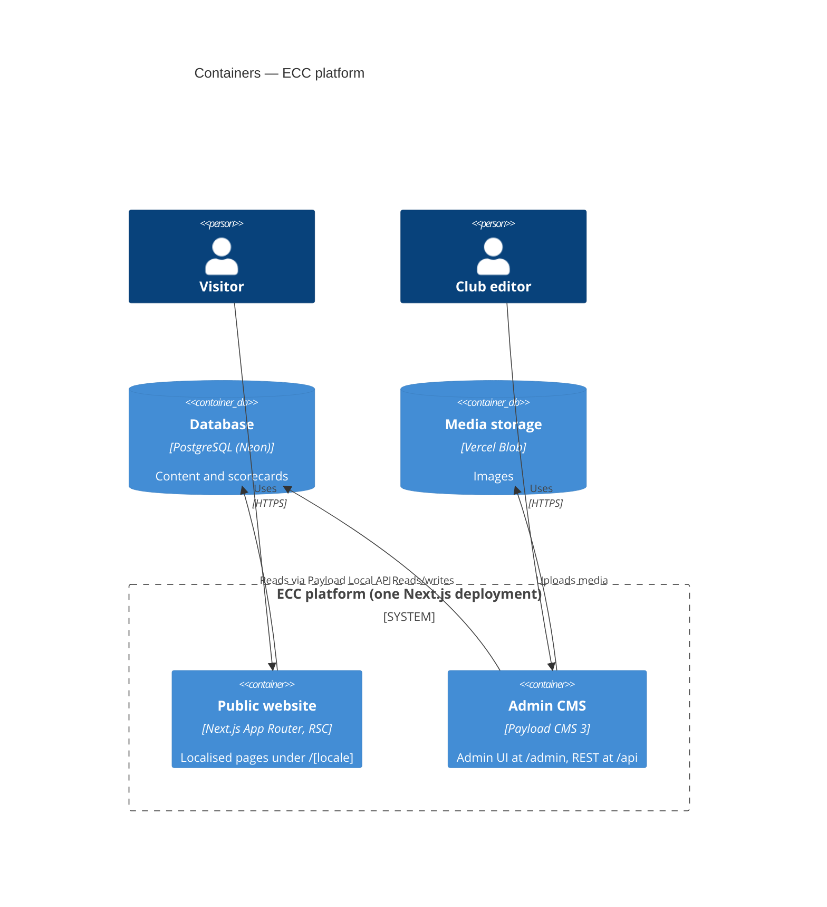
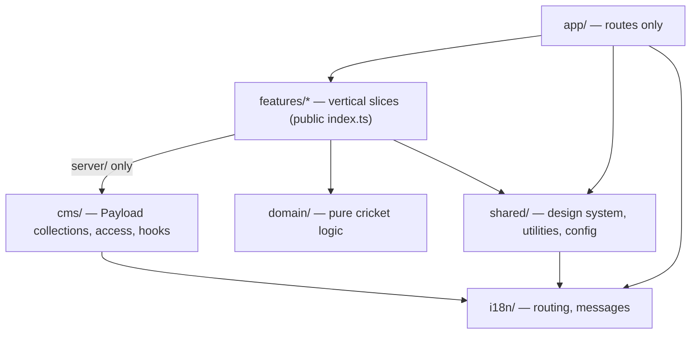

# 5. Building Block View

## 5.1 Containers (C4 level 2)

## 5.2 Modules (C4 level 3) — `src/`

| Module               | Responsibility                                                       | May depend on                              |
| -------------------- | -------------------------------------------------------------------- | ------------------------------------------ |
| `app/`               | Route composition, metadata; no business logic                       | features (via `index.ts`), shared, i18n    |
| `features/<x>/`      | One business capability (players, fixtures, …)                       | domain, shared, other features' `index.ts` |
| `features/*/server/` | Data access through the Payload Local API                            | + Payload                                  |
| `domain/`            | Pure TypeScript: averages, strike rate, economy, NRR, milestones     | nothing outside `domain/`                  |
| `shared/`            | `ui/` design system, `lib/` utilities, `config/` env and site config | i18n                                       |
| `cms/`               | Payload collections, globals, access control, hooks                  | Payload, i18n                              |
| `i18n/`              | Locales, routing, message catalogues                                 | next-intl                                  |

These rules are encoded in [`.dependency-cruiser.cjs`](../../.dependency-cruiser.cjs) and checked in CI.

### Current contents

| Path               | Contents                                                |
| ------------------ | ------------------------------------------------------- |
| `domain/cricket/`  | `calculateBattingAverage`, `calculateStrikeRate`        |
| `shared/ui/`       | `Button`, `SkipLink`, `JsonLd`                          |
| `shared/lib/`      | `cn`, SEO helpers (`buildAlternates`, JSON-LD builders) |
| `shared/config/`   | `parseServerEnv` (Zod), `siteConfig`                    |
| `cms/collections/` | `users`, `media`                                        |
| `features/`        | Empty — features arrive in follow-up PRs                |
