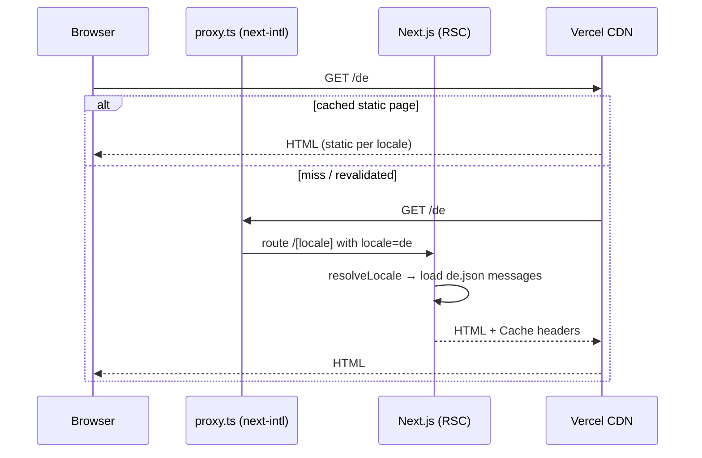
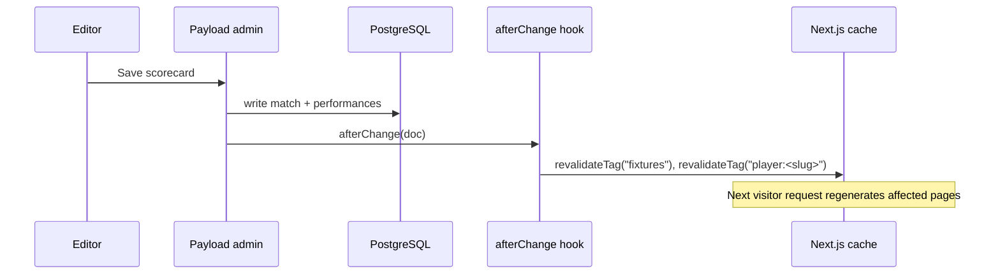

# 6. Runtime View

## 6.1 Visitor requests a localised page

Requests to `/` are served in English (default locale, no prefix). Unknown paths under a locale render the localised `not-found` page with HTTP 404.

## 6.2 Editor publishes content (planned)

