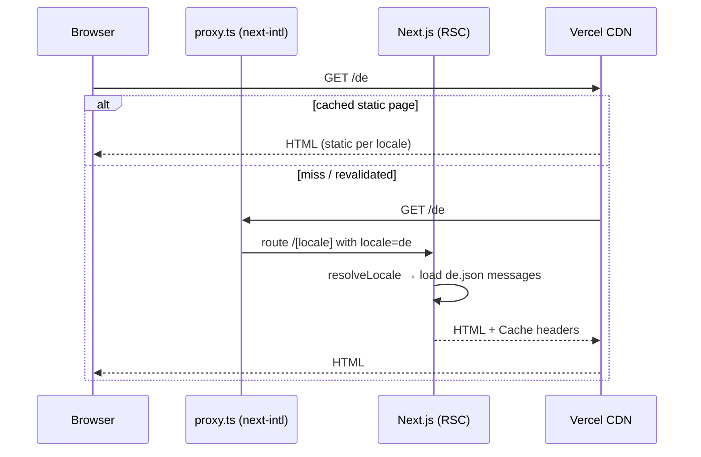
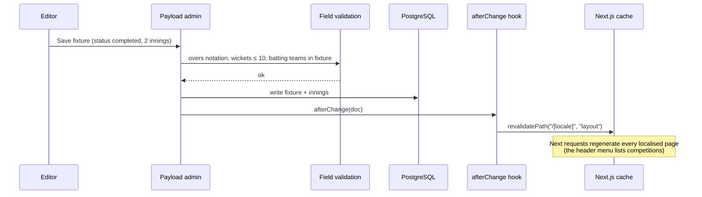
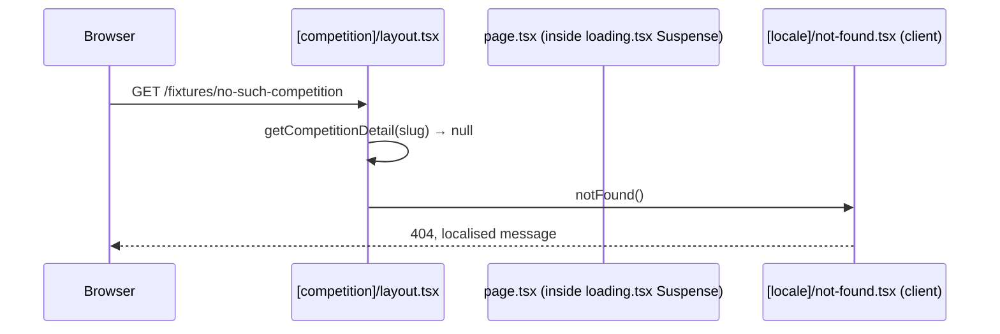

# 6. Runtime View

## 6.1 Visitor requests a localised page

Requests to `/` are served in English (default locale, no prefix). Unknown paths under a locale render the localised `not-found` page with HTTP 404.

## 6.2 Editor records a result

Winner and margin are not stored for results decided on the field: `mapFixture` derives them with `resolveMatchResult` whenever the page is regenerated. Seeds and scripts pass `context.disableRevalidate` because they run outside a Next.js request.

## 6.3 Fixtures pages build

`/fixtures` and every `/fixtures/[competition]` page are statically generated for both locales at build time (`generateStaticParams` reads competition slugs from the database). A competition created after the build renders on its first request and is then cached.

## 6.4 Unknown competition

The slug is validated in the segment **layout**, outside the page's `loading.tsx` Suspense boundary; throwing `notFound()` inside that boundary would already have streamed a 200 status. `getCompetitionDetail` is wrapped in React `cache()`, so layout, metadata and page share one query.
