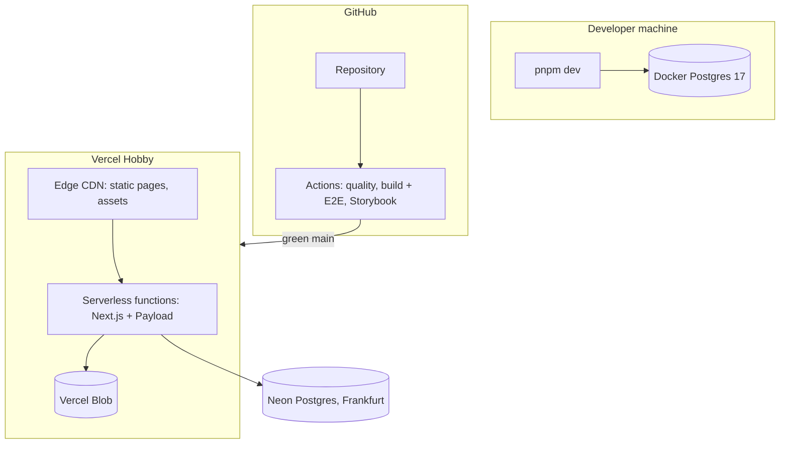

# 7. Deployment View

| Environment | Where                           | Database                       | Media            |
| ----------- | ------------------------------- | ------------------------------ | ---------------- |
| Local       | `pnpm dev`                      | Docker Postgres (`pnpm db:up`) | `./media` folder |
| CI          | GitHub Actions                  | none (build placeholders)      | —                |
| Preview     | Vercel preview per PR (planned) | Neon branch (planned)          | Vercel Blob      |
| Production  | Vercel                          | Neon (EU region)               | Vercel Blob      |

Configuration is provided through environment variables, validated at startup ([`src/shared/config/env.ts`](../../src/shared/config/env.ts)); see [`.env.example`](../../.env.example).
