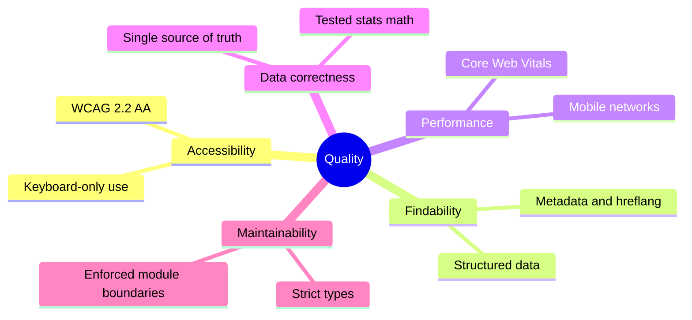

# 10. Quality Requirements

## 10.1 Quality tree

## 10.2 Quality scenarios

| ID   | Quality          | Scenario                                                                               | Measure / enforcement                                                                  |
| ---- | ---------------- | -------------------------------------------------------------------------------------- | -------------------------------------------------------------------------------------- |
| QS-1 | Accessibility    | A keyboard-only user opens any page and reaches the main content with one Tab + Enter. | Playwright skip-link test                                                              |
| QS-2 | Accessibility    | Any public page is scanned with axe (WCAG 2.2 AA tags).                                | Zero violations in `e2e/*.spec.ts`; CI blocks merge                                    |
| QS-3 | Findability      | Google crawls `/de`.                                                                   | Canonical `/de`, hreflang `en`/`de`/`x-default`, in sitemap                            |
| QS-4 | Performance      | A player opens the fixtures page on a mid-range phone over 4G.                         | LCP < 2.5 s, INP < 200 ms, CLS < 0.1 (Lighthouse CI, planned)                          |
| QS-5 | Data correctness | An editor corrects a batter's runs in one scorecard.                                   | Average, strike rate, Hall of Fame update without other edits; `domain/` 100% coverage |
| QS-6 | Maintainability  | A developer imports a feature's internal file from another feature.                    | dependency-cruiser fails CI                                                            |
| QS-7 | Operability      | Production is deployed with a missing `PAYLOAD_SECRET`.                                | Startup fails with a readable Zod error                                                |
